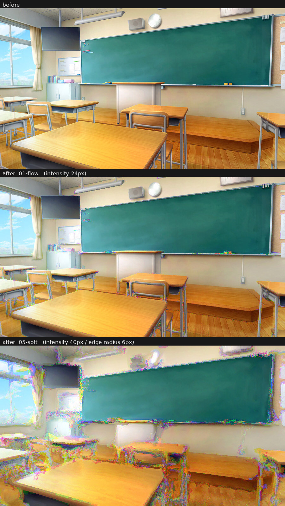
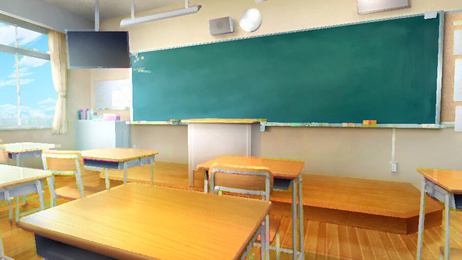
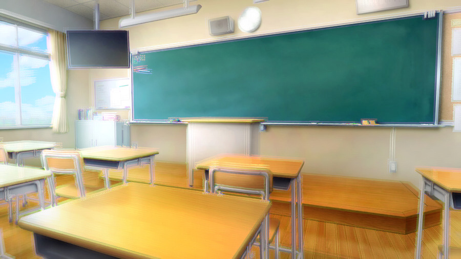
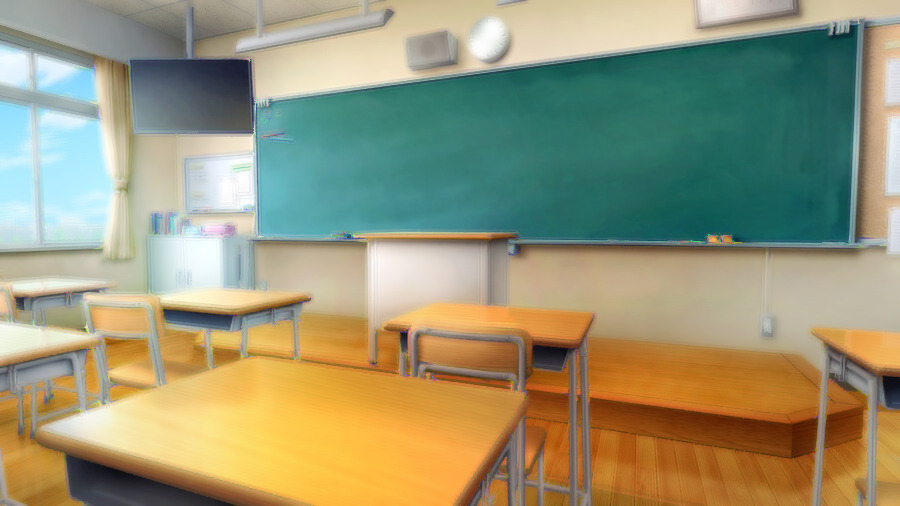
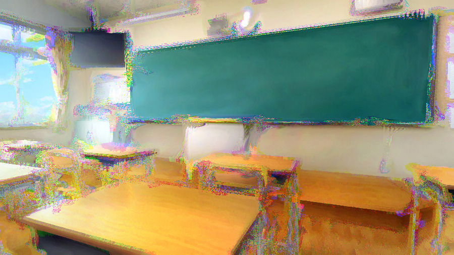
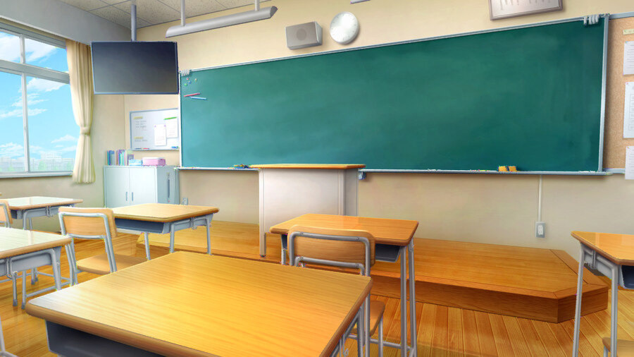
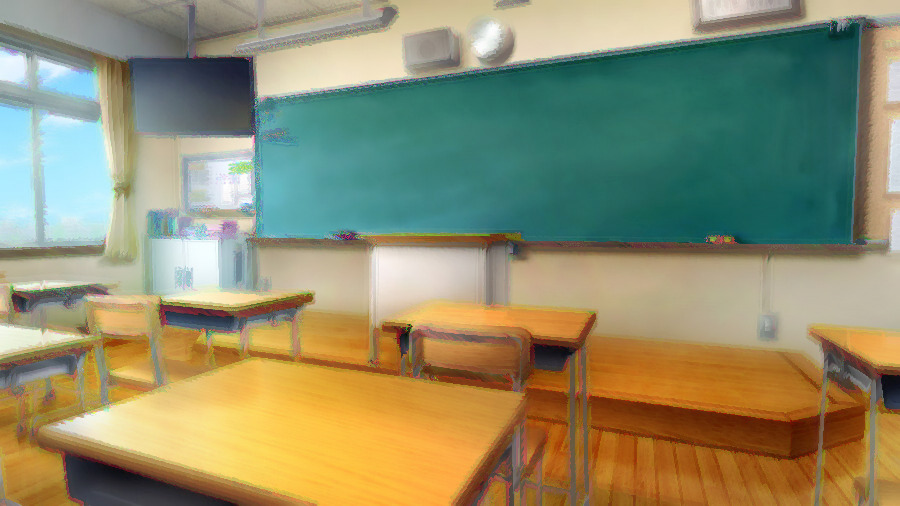

# Sa_CrossChroma

[](https://github.com/sabiasagimp4-ai/Sa_crosschroma/actions/workflows/test.yml)

RGBを分離し、各チャンネルを **別チャンネルの輪郭** で変形してから再合成する、
ゆっくりMovieMaker4（YMM4）用の映像エフェクトプラグイン。

普通の色収差が「RGBを別々にずらす」だけなのに対して、これは **色同士が互いを変形させる色収差**。
Rの動き方はGの輪郭が決め、Gの動き方はBが決め、Bの動き方はRが決める、という循環になっている。



*上から、元画像 / 控えめな設定（01-flow）/ 強めの設定（05-soft）。すべて等倍。*

## できること

- **RをGの輪郭で変位**、**GをBの輪郭で変位**、**BをRの輪郭で変位**（循環的な相互作用）
- **勾配を90°回転**させて、輪郭を横切るのではなく **輪郭に沿って色を流す**
- **他チャンネルの明るさでBlur / 膨張 / 収縮を制御**する
- 変位を細かく刻んで進める（**ステップ数**）。1歩ごとに進んだ先の輪郭を見直すので、
  直線的に飛ばずに輪郭に沿った曲線を描く
- **エフェクト全体を繰り返す**（**反復回数**）。変形した結果をもう一度変形して効果を重ねる
- 変形元・制御元のチャンネルは、プリセットからもチャンネル単位のカスタムからも指定できる
- 変位量・角度・ステップ数・検出半径などはすべてアニメーション可能

## サンプル

テスト画像（`docs/samples/00-source.jpg`）に適用した結果。**すべて等倍**（900x506、切り抜きなし）。
生成は `python3 tools/reference/render_samples.py docs/samples/00-source.jpg docs/samples`。

| | |
|---|---|
| **元画像**<br> | **01-flow** — 輪郭に沿って色を流す<br>`強度24px / 角度90° / ステップ数8`<br> |
| **02-displace** — 輪郭を横切る向きに変位<br>`強度16px / 角度0°`<br> | **03-morphology** — 他チャンネルの明るさで膨張<br>`強度10px / 膨張100% / 半径4px`<br> |
| **04-blur** — 他チャンネルの明るさでぼかす<br>`強度12px / ぼかし100% / 半径3px`<br> | **05-soft** — 広い濃淡に反応させる<br>`強度40px / 検出半径6px / ガンマ0.6`<br> |
| **06-subtle** — 実用的な控えめの設定<br>`強度6px / 感度200% / 適用量60%`<br> | **07-full** — 変位・ぼかし・収縮を全部使う<br>`強度28px / 角度120° / 逆回転 / 収縮-60%`<br> |
| **08-iterate** — 全体を繰り返して変形を重ねる<br>`強度10px / ステップ数4 / 反復回数3`<br> | |

細部を見たいときは[拡大した比較](docs/samples/comparison.jpg)（机のフレーム周りを2倍）。

## 効かせかたの目安

全パラメーターを1項目ずつ振って測った結果から。
比較画像と測定値は **[docs/parameters.md](docs/parameters.md)** にある。

| 知りたいこと | 分かったこと |
|---|---|
| 絵が荒れる原因は？ | 強度ではなく **1歩あたりの移動量**。ステップ数さえ一緒に上げれば、強度は上げても荒れない |
| もっと滑らかにしたい | ステップ数より **反復回数**。同じ移動量なら反復のほうが綺麗で、値段もほぼ同じ |
| 効果は強く、ノイズは出したくない | **感度を上げてガンマも一緒に上げる**。片方だけ動かすとノイズが増えるか効果が消える |
| 色収差っぽさが足りない | **検出半径**。1pxは線画の縁、8pxは形ごと溶ける。性格が変わる |
| 全体が派手すぎる | **適用量**。流れの形を変えずに濃さだけ落とせる |

歩幅の目安は `ステップ数 ≧ 強度 ÷ 3`（軽さ優先なら `÷ 8`）。
1歩3pxで頭打ちになるので、それより細かくしても時間が増えるだけ。

## パラメーター

### 変位

| 項目 | 既定値 | 説明 |
|---|---|---|
| 強度 | 20px | 輪郭に沿って色をずらす量 |
| 角度 | 90° | 0°で輪郭を横切る向き、90°で輪郭に沿う向き |
| ステップ数 | 8 | 変位を何回に分けて進めるか。増やすほど滑らかになるが重くなる（移動量は変わらない） |
| 組み合わせ | 順回転 | `順回転 R←G←B←R` / `逆回転` / `R⇔G交換` / `G⇔B交換` / `B⇔R交換` / `輝度` / `カスタム` |
| R ← / G ← / B ← | G / B / R | 「カスタム」のとき、各チャンネルを変形させるチャンネル |

### 輪郭

| 項目 | 既定値 | 説明 |
|---|---|---|
| 検出半径 | 1px | 輪郭を調べる幅。広げるとゆるやかな濃淡にも反応する（1pxを超えると勾配の計算が倍になる） |
| 感度 | 100% | 弱い輪郭をどれだけ拾うか。上げるほど平坦な部分も動く |
| ガンマ | 1.00 | 小さくすると弱い輪郭も強く、大きくすると強い輪郭だけが動く |

### 変調（他チャンネルの明るさでBlur / 膨張 / 収縮を制御）

| 項目 | 既定値 | 説明 |
|---|---|---|
| 制御チャンネル | 残りのチャンネル | `残りのチャンネル`（自分でも変形元でもない3つ目） / `変形元と同じ` / `自分自身` / `輝度` / `制御しない` / `カスタム` |
| R ← / G ← / B ← | B / R / G | 「カスタム」のとき、各チャンネルの強さを決めるチャンネル |
| 明暗反転 | オフ | 制御チャンネルの明るい所と暗い所を入れ替える |
| ぼかし | 0% | 制御チャンネルが明るいほど強くぼかす |
| 膨張 / 収縮 | 0% | プラスで明るい部分が広がり、マイナスで痩せる |
| 半径 | 2px | ぼかし・膨張・収縮の半径 |

### 仕上げ

| 項目 | 既定値 | 説明 |
|---|---|---|
| 反復回数 | 1回 | エフェクト全体を繰り返す回数（最大8）。変形した結果をさらに変形するので効果が積み重なる |
| 適用量 | 100% | 元の映像とのブレンド量。反復回数が2以上のときは1回ごとに適用される |

## インストール

まだリリースを出していないので、いまは自分でビルドする（下記）。
ビルドすると `Sa_CrossChroma.dll` が `YMM4フォルダ\user\plugin\Sa_CrossChroma\` に
自動でコピーされる。手で置いても同じ。

YMM4を起動して `設定` → `プラグイン` → `プラグイン一覧` に `Sa_CrossChroma` が出ていれば成功。
使うときは、映像アイテムの `エフェクトを追加` → `加工` → `クロスクロマ`。

配布するときは、dllをzipで固めて拡張子を `.ymme` に変えるとワンクリックで入るようになる
（[YMM4の公式サンプル](https://github.com/manju-summoner/YMM4SamplePlugin) に手順がある）。

## ビルド

必要なもの:

- YMM4 本体（v4.47.0.0以降 = .NET10版）
- Visual Studio 2022 以降、または .NET SDK
- Windows SDK（HLSLのコンパイルに `fxc.exe` を使う。Visual Studioの「C++によるデスクトップ開発」に付いてくる）

手順:

1. `Directory.Build.props.sample` をコピーして `Directory.Build.props` を作り、
   `YMM4DirPath` にYMM4のインストールフォルダを設定する（末尾の `\` を忘れずに）

   ```xml
   <YMM4DirPath>C:\Program Files\YMM4\</YMM4DirPath>
   ```

2. `Sa_CrossChroma.sln` を開いてビルドする（または `dotnet build -c Release`）

ビルド時に `Shaders\CrossChroma.hlsl` が `fxc.exe` で `ps_4_0` にコンパイルされてdllに埋め込まれ、
dllは `YMM4フォルダ\user\plugin\Sa_CrossChroma\` に自動でコピーされる。
`fxc.exe` が見つからない場合は `Directory.Build.props` に `FxcPath` を直接書く。

> **v4.46.x.x以前のYMM4向けにビルドする場合**は、`src/Sa_CrossChroma/Sa_CrossChroma.csproj` の
> `<TargetFramework>` を `net8.0-windows` に変更する。

## ドキュメント

- **[docs/parameters.md](docs/parameters.md)** — パラメーターを振った実験結果（比較画像と測定値）
- **[docs/internals.md](docs/internals.md)** — 処理の流れ、リポジトリ構成、テストの走らせかた

```bash
pip install numpy pillow
python3 tools/reference/test_crosschroma.py                                   # テスト
python3 tools/reference/render_samples.py docs/samples/00-source.jpg docs/samples  # サンプル生成
```

> **C#の実ビルドとYMM4上での動作確認は未実施**（Windows + YMM4本体が必要なため）。
> HLSLはCIでDXCに通してあるが、本番の `fxc` / `ps_4_0` でのコンパイルは未検証。
> アルゴリズムはCPUリファレンス実装に対する36件のテストで検証している。詳細は
> [docs/internals.md](docs/internals.md#動作確認について)。

## ライセンス

未設定。公開する場合は、リポジトリにライセンスファイルを追加すること。

`docs/samples/` の画像は、フリー素材のテスト画像とその加工結果。
