# Sa_CrossChroma

RGBを分離し、各チャンネルを **別チャンネルの輪郭** で変形してから再合成する、
ゆっくりMovieMaker4（YMM4）用の映像エフェクトプラグイン。

普通の色収差が「RGBを別々にずらす」だけなのに対して、これは **色同士が互いを変形させる色収差**。
Rの動き方はGの輪郭が決め、Gの動き方はBが決め、Bの動き方はRが決める、という循環になっている。

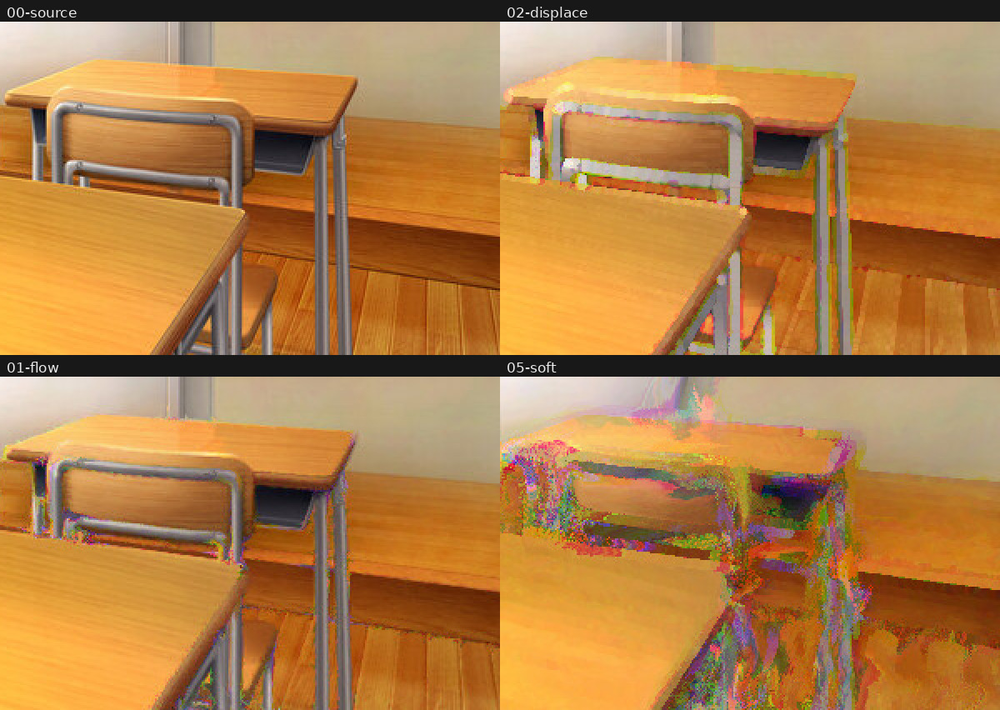

## できること

- **RをGの輪郭で変位**、**GをBの輪郭で変位**、**BをRの輪郭で変位**（循環的な相互作用）
- **勾配を90°回転**させて、輪郭を横切るのではなく **輪郭に沿って色を流す**
- **他チャンネルの明るさでBlur / 膨張 / 収縮を制御**する
- 変位を **細かく刻んで進める**（ステップ数）。1歩ごとに進んだ先の輪郭を見直すので、
  直線的に飛ぶのではなく輪郭に沿った滑らかな曲線を描く
- **エフェクト全体を繰り返す**（反復回数）。変形した結果をもう一度変形して、効果を積み重ねる
- 変形元・制御元のチャンネルは、プリセットからもチャンネル単位のカスタムからも指定できる
- 変位量・角度・ステップ数・輪郭の検出半径などはすべてアニメーション可能

## サンプル

添付のテスト画像（`docs/samples/00-source.jpg`）に適用した結果。
すべて `tools/reference/render_samples.py` で生成している。

| | |
|---|---|
| **元画像**<br> | **01-flow** — 輪郭に沿って色を流す<br>`強度24px / 角度90° / ステップ数8 / 感度150%`<br> |
| **02-displace** — 輪郭を横切る向きに変位<br>`強度16px / 角度0° / 順回転 / 感度150%`<br> | **03-morphology** — 他チャンネルの明るさで膨張<br>`強度10px / 角度90° / 膨張100% / 半径4px`<br> |
| **04-blur** — 他チャンネルの明るさでぼかす<br>`強度12px / 角度90° / ぼかし100% / 半径3px`<br> | **05-soft** — 広い濃淡に反応させる<br>`強度40px / 検出半径6px / 感度250% / ガンマ0.6`<br> |
| **06-subtle** — 実用的な控えめの設定<br>`強度6px / 角度90° / 感度200% / 適用量60%`<br> | **07-full** — 変位・ぼかし・収縮を全部使う<br>`強度28px / 角度120° / 逆回転 / ぼかし60% / 収縮-60%`<br> |
| **08-iterate** — 全体を繰り返して変形を重ねる<br>`強度10px / 角度90° / ステップ数4 / 反復回数3`<br> | |

### ステップ数の違い

同じ設定（01-flow）でステップ数だけを変えたもの。
1歩で飛ぶと輪郭の色がブツ切りになるが、刻むほど輪郭に沿った連続した流れになる。

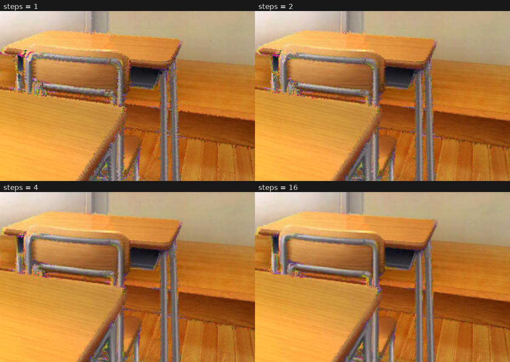

## 仕組み

1ピクセルにつき、次の順で計算する（反復回数が1なら、すべて1パスのピクセルシェーダー内）。

1. **勾配を求める**
   3x3のSobelフィルタを1組だけ回して、R / G / B / 輝度の4つの勾配 `(gx, gy)` を同時に得る。
   タップ位置は「検出半径」でスケールするので、半径を広げるとゆるやかな濃淡にも反応する。
   Sobelは1/4に正規化してあり、0→1のステップエッジで長さがちょうど1.0になる。

   検出半径が1px以下のときは、**バイリニア補間を使って4タップで済ませる**。
   `(±0.5, ±0.5)` のタップはそれぞれ2x2の平均になるので、

   ```
   gx = (右上 + 右下) - (左上 + 左下)
   gy = (左下 + 右下) - (左上 + 右上)
   ```

   を展開するとちょうど Sobel/4 のカーネルと一致する。タップ数が半分になる。
   半径を広げると2x2の平均では平滑化が足りずにざらつくので、そのときは8タップ版に戻す。

2. **変位先まで歩く**（チャンネルごと）
   自分に割り当てられたドライバーチャンネルの勾配を使い、1歩あたり `強度 / ステップ数` ずつ進む。

   ```
   pos = uv
   ステップ数だけ繰り返す:
       g      = ドライバーチャンネルの勾配 (pos の位置で)
       dir    = normalize(g)                          // 輪郭に垂直な向き
       amount = pow(saturate(|g| * 感度), ガンマ)      // 輪郭の強さ 0-1
       pos   += rotate(dir, 角度) * amount * (強度 / ステップ数)
   ```

   1歩目の勾配は手順1で計算済みのものを使い回し、2歩目以降はその場で取り直す。
   そのため **移動の合計量は変わらず、経路だけが直線から曲線になる**。
   輪郭が消えた場所では `amount` が0になるので、流れは勝手に止まる。
   ステップ数1なら従来どおりの「一発で飛ぶ」挙動。

   勾配が無い画素はそもそも1歩も動けない。動かなければ位置も変わらず、
   次に取り直す勾配も同じ値になる。つまり残りのステップは何も起こさないので、
   そこでループを抜けている（結果は1ビットも変わらない）。
   平坦な塗りが多い絵ほど、ここで大きく浮く。

3. **変位先でサンプリングする**
   `自分のチャンネル` の値だけを変位先から拾う。アルファは動かさないので、
   絵のシルエットは元のまま保たれる。

4. **他チャンネルの明るさでフィルタする**
   変位先の周囲3x3（半径は可変）から平均・最大・最小を取り、
   制御チャンネルの明るさ `m` を重みにして混ぜる。

   ```
   value = lerp(value, 平均, ぼかし量 * m)    // Blur
   value = lerp(value, 最大, 膨張量 * m)      // Dilate
   value = lerp(value, 最小, 収縮量 * m)      // Erode
   ```

5. **元画像とブレンドして出力する**

反復回数を2以上にすると、この出力をそのまま次のパスの入力に戻して同じ処理を繰り返す。
C#側では同じエフェクトを反復回数ぶん数珠つなぎにしている（`入力 → 段n → … → 段1 → 出力`）。
ステップ数が「同じ勾配の上を細かく歩く」のに対して、反復は
**変形した結果から勾配を取り直す** ので、変形そのものが積み重なって崩れていく。

透明な部分には色の情報が無いため、完全に透明なタップは中心画素の値で代用している。
黒として扱うとシルエットの外側に偽の輪郭が出てしまうため。

## パラメーター

### 変位

| 項目 | 既定値 | 説明 |
|---|---|---|
| 強度 | 20px | 輪郭に沿って色をずらす量 |
| 角度 | 90° | 0°で輪郭を横切る向き、90°で輪郭に沿う向き |
| ステップ数 | 8 | 変位を何回に分けて進めるか。増やすほど滑らかになるが、そのぶん重くなる（移動量は変わらない） |
| 組み合わせ | 順回転 | `順回転 R←G←B←R` / `逆回転` / `R⇔G交換` / `G⇔B交換` / `B⇔R交換` / `輝度` / `カスタム` |
| R ← / G ← / B ← | G / B / R | 「カスタム」のとき、各チャンネルを変形させるチャンネル |

### 輪郭

| 項目 | 既定値 | 説明 |
|---|---|---|
| 検出半径 | 1px | 輪郭を調べる幅。広げるとゆるやかな濃淡にも反応する |
| 感度 | 100% | 弱い輪郭をどれだけ拾うか。上げるほど平坦な部分も動く |
| ガンマ | 1.00 | 小さくすると弱い輪郭も強く、大きくすると強い輪郭だけが動く |

### 変調（他チャンネルの明るさでBlur / 膨張 / 収縮を制御）

| 項目 | 既定値 | 説明 |
|---|---|---|
| 制御チャンネル | 残りのチャンネル | `残りのチャンネル`（自分でも変形元でもない3つ目） / `変形元と同じ` / `自分自身` / `輝度` / `制御しない` / `カスタム` |
| R ← / G ← / B ← | B / R / G | 「カスタム」のとき、各チャンネルの強さを決めるチャンネル |
| 明暗反転 | オフ | 制御チャンネルの明るい所と暗い所を入れ替える |
| ぼかし | 0% | 制御チャンネルが明るいほど強くぼかす |
| 膨張 / 収縮 | 0% | プラスで明るい部分が広がり、マイナスで痩せる |
| 半径 | 2px | ぼかし・膨張・収縮の半径 |

### 仕上げ

| 項目 | 既定値 | 説明 |
|---|---|---|
| 反復回数 | 1回 | エフェクト全体を繰り返す回数（最大8）。変形した結果をさらに変形するので効果が積み重なる |
| 適用量 | 100% | 元の映像とのブレンド量。反復回数が2以上のときは1回ごとに適用される |

## パラメーターを振ってみた結果

1項目ずつ振って、同じ場所（机のフレーム周り）を切り出して並べたもの。
すべて `python3 tools/reference/render_samples.py docs/samples/00-source.jpg docs/samples` で再生成できる。

表の見かたは2つ。

- **ザラつき** … 隣り合う画素の差の平均。px単位のノイズに反応する。
  元画像を `1.00x` として比べている（元画像は5.65/255）。**小さいほど滑らか**
- **平均変化** … 元画像との差の平均（/255）。**大きいほど効果が強い**

### 結論

| 知りたいこと | 分かったこと |
|---|---|
| 絵が荒れる原因は？ | 強度ではなく **1歩あたりの移動量**。ステップ数さえ一緒に上げれば、強度は上げても荒れない |
| もっと滑らかにしたい | ステップ数より **反復回数**。同じ移動量なら反復のほうが綺麗で、値段もほぼ同じ |
| 効果は強く、ノイズは出したくない | **感度を上げてガンマも一緒に上げる**。片方だけ動かすとノイズが増えるか効果が消える |
| 色収差っぽさが足りない | **検出半径**。1pxは線画の縁、8pxは形ごと溶ける。性格が変わる |
| 全体が派手すぎる | **適用量**。流れの形を変えずに濃さだけ落とせる |

以下は測定条件つきの詳細。すべて CPU リファレンス実装（`tools/reference/crosschroma.py`）で、
この1枚のテスト画像の1箇所を測ったもの。絵柄が変われば数字も変わる。

### 強度 — 上げても壊れない

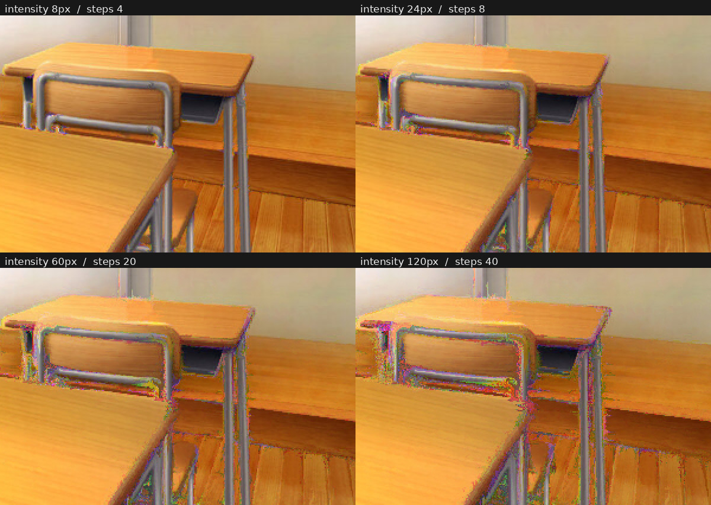

1歩あたりを3pxに固定したまま強度だけ伸ばした。

| 強度 | ステップ数 | ザラつき | 平均変化 |
|---|---|---|---|
| 8px | 3 | 0.90x | 2.1 |
| 24px | 8 | 0.93x | 4.0 |
| 60px | 20 | 1.05x | 6.1 |
| 120px | 40 | 1.20x | 8.1 |
| 240px | 80 | 1.47x | 10.9 |

画像は上の4段階。**強度を30倍にしても、効果は5.2倍、ザラつきは元画像の0.90倍から1.47倍に上がるだけ。**
歩くたびに輪郭を取り直していて、輪郭が消えた所では勝手に止まるので、
移動量を伸ばしても行き先が無限に散らばるわけではない。120pxでも机の形は読める。

強度8pxではザラつきが `0.90x` と **元画像より下がっている**。
バイリニア補間で半端な位置から拾うぶん、わずかに平滑化が掛かるため。

### 1歩あたりの移動量 — 荒れるのはここ

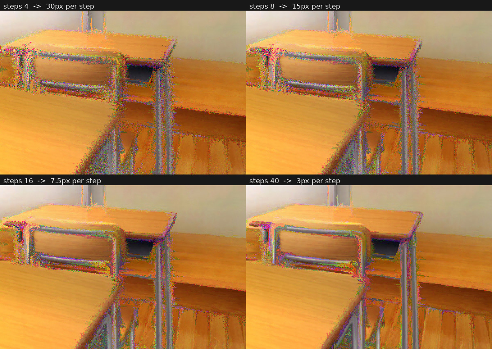

強度を120pxに固定して、ステップ数だけを変えた（画像はこのうち4段階）。

| ステップ数 | 1歩 | ザラつき |
|---|---|---|
| 2 | 60.0px | 1.95x |
| 4 | 30.0px | 1.81x |
| 8 | 15.0px | 1.62x |
| 16 | 7.5px | 1.42x |
| 24 | 5.0px | 1.32x |
| 40 | 3.0px | 1.20x |
| 60 | 2.0px | 1.15x |
| 120 | 1.0px | 1.14x |

歩幅が広いと、隣り合う画素が途中の輪郭を見落としたままばらばらの方向へ飛んでいく。
それが色のノイズになる。

**しきい値があるわけではなく、歩幅に対してなだらかに悪くなる。**
ただし下げ止まりははっきりしていて、1歩3pxで `1.20x`、
そこから1pxまで詰めても `1.14x` にしかならない。**3pxより細かくしても絵はほぼ変わらず、時間だけ増える。**

```
ステップ数 ≧ 強度 ÷ 3     ← これで頭打ちのところまで行く
ステップ数 ≧ 強度 ÷ 8     ← 軽さ優先ならこのへんが妥協点 (1歩8px)
```

既定はステップ数8。既定の強度20pxなら1歩2.5pxで、上の表の頭打ちの側に入っている。
強度を上げるならステップ数も一緒に上げること。

### 角度 — 90°がいちばん「効果が薄い」

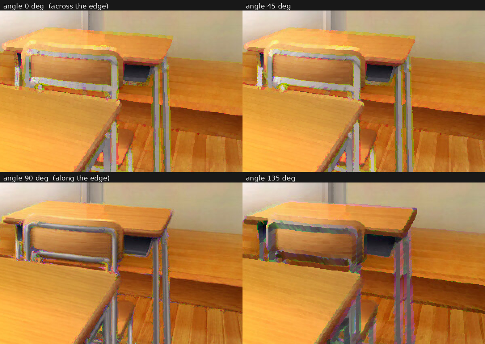

| 角度 | 平均変化 | 見え方 |
|---|---|---|
| 0° | 9.4 | 輪郭を横切る。普通の色収差に近い縁取り |
| 45° | 9.0 | 斜めに引っ張られる |
| 90° | **4.0** | 輪郭に沿う。縁は保たれたまま色だけ滑る |
| 135° | 8.8 | 外へ押し出され、形が二重に膨らむ |

**いちばん「らしく」見える90°が、数値上はいちばん変化が小さい。**
輪郭に沿って動くと、移動先にあるのは元と似た色なので、大きく動いても色は大きく変わらない。
逆に0°や135°は輪郭をまたぐぶん、少し動くだけで色が入れ替わる。

数字の大きさは「派手さ」ではなく「元画像からの遠さ」なので、見た目の強さとは別物、ということ。

### 検出半径 — 性格そのものが変わる

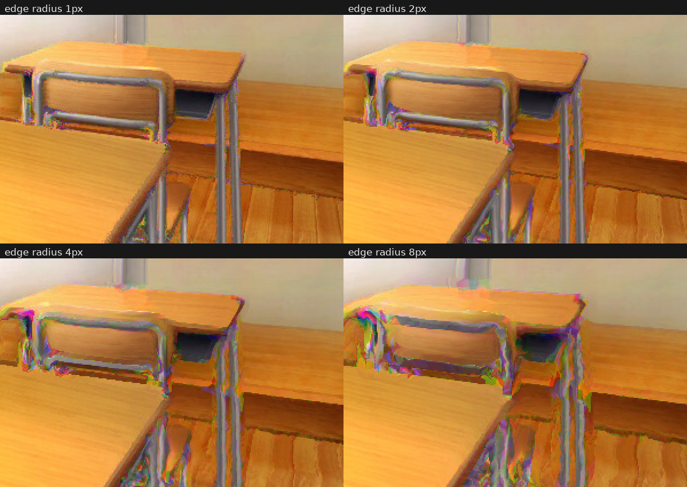

| 検出半径 | 平均変化 | 見え方 |
|---|---|---|
| 1px | 4.0 | 線画の縁だけが色づく。色収差寄り |
| 2px | 5.3 | 縁が太くなる |
| 4px | 7.4 | 面の陰影にも反応し、塗りが流れはじめる |
| 8px | 9.9 | 形ごと溶ける。液状化フィルタ寄り |

このパラメーターだけは強弱ではなく **別のエフェクトになる**。
ただし1pxを超えると勾配の計算が4タップから8タップに倍増するので、
**「効果を強くしたいだけ」なら半径ではなく感度を上げるほうが安い**（次項）。

### 感度とガンマ — セットで動かす

感度だけを振ったもの（ガンマ1.0固定）。上げるほど平坦な塗りまで動きだす。

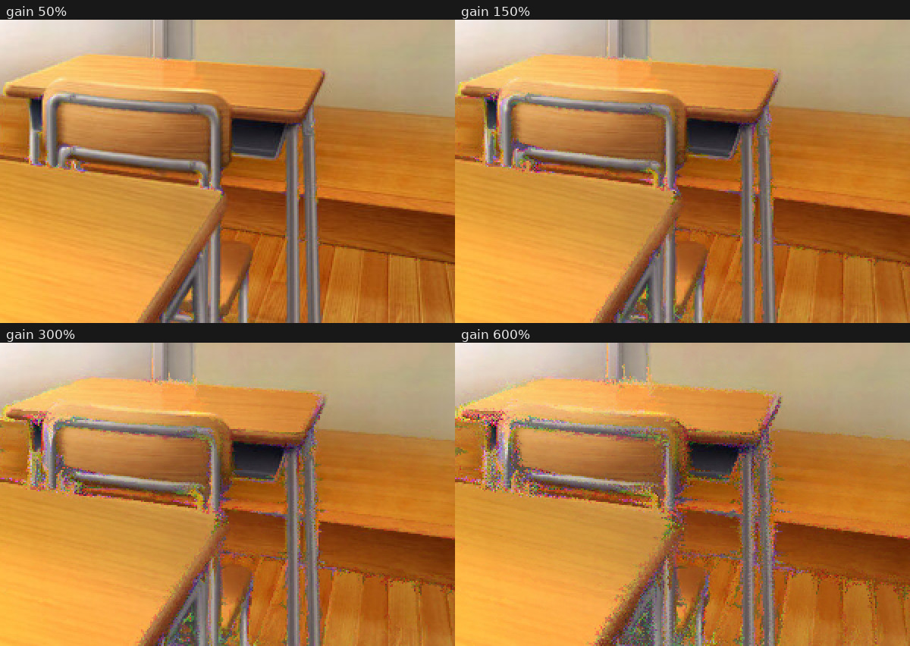

感度600%のまま、ガンマだけを振ったもの。平坦な部分の動きだけが消えていく。

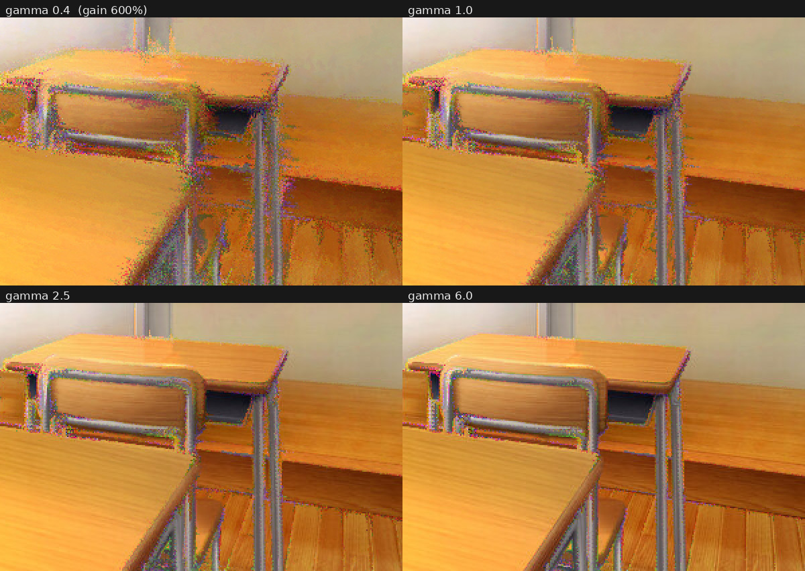

強度24px / ステップ数8での組み合わせ。

| 感度 | ガンマ | ザラつき | 平均変化 |
|---|---|---|---|
| 150% | 1.0 | 0.93x | 4.0 |
| 150% | 2.5 | 0.98x | 0.9 |
| 150% | 6.0 | 1.00x | 0.2 |
| 300% | 1.0 | 1.07x | 5.9 |
| 300% | 2.5 | 1.03x | 2.4 |
| 300% | 6.0 | 1.03x | 1.1 |
| 600% | 1.0 | 1.32x | **8.1** |
| 600% | 2.5 | 1.17x | 4.6 |
| 600% | 6.0 | **1.15x** | 2.9 |

読みかた:

- **感度だけ上げる**（600% / ガンマ1.0）→ 効果は最大だが、ザラつきも最大の `1.32x`。
  平坦な塗りまで動きだすため
- **ガンマだけ上げる**（150% / ガンマ6.0）→ 平均変化0.2。ほぼ何も起きない
- **両方上げる**（600% / ガンマ6.0）→ 効果2.9を保ったままザラつきは `1.15x` まで下がる

ガンマは輪郭の強さを `0-1` に潰したあとに掛かるので、
**感度で全体を持ち上げてから、ガンマで弱い輪郭だけを削る** という順で効く。
感度を上げたらガンマも上げる、が基本。

ただしガンマは感度の副作用を完全には打ち消さない。
`600% / ガンマ6.0` の `1.15x` は、`150% / ガンマ1.0` の `0.93x` より依然ノイジーで、効果も弱い。
強い輪郭だけをはっきり動かしたいとき向けの組み合わせであって、万能の解毒剤ではない。

### 反復回数 — 同じ移動量をいちばん綺麗に稼ぐ

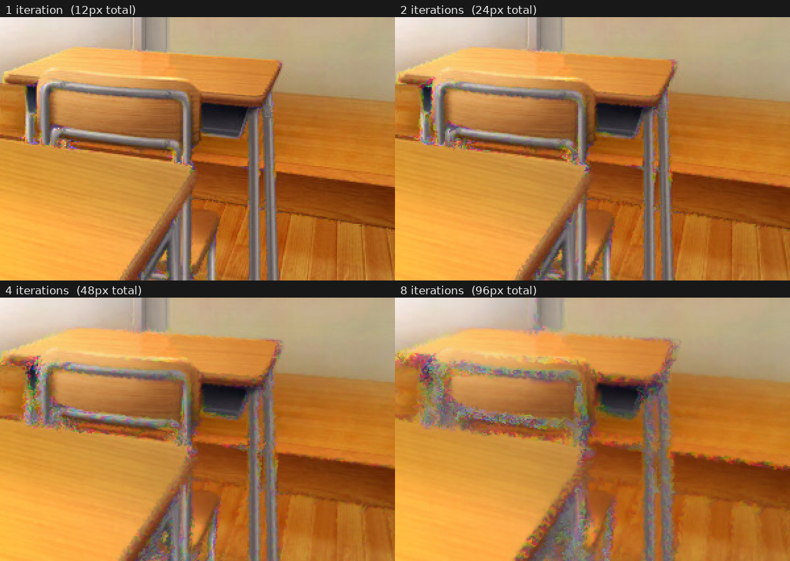

これが今回いちばん意外だった結果。**合計移動量96pxを、4通りの分けかたで作って比べた。**
4つとも1歩あたり3px・総ステップ数32で揃えてある。違うのは「何パスに分けたか」だけ。

| 構成 | 総ステップ数 | タップ数 | ザラつき | 平均変化 |
|---|---|---|---|---|
| 強度96px × 1回（ステップ32） | 32 | 379 | 1.15x | 7.4 |
| 強度48px × 2回（ステップ16） | 32 | 374 | 1.10x | 7.9 |
| 強度24px × 4回（ステップ8） | 32 | 364 | 0.92x | 7.9 |
| 強度12px × 8回（ステップ4） | 32 | **344** | **0.71x** | **8.1** |

**反復に振ったほうが、効果は強く・ノイズは少なく・タップ数まで少ない。** 3つとも勝っている。

理由は2つ。パスごとにバイリニア補間で描き直すので、そのたびに軽く平滑化が掛かること。
そして次のパスは **その平滑化された絵から勾配を取り直す** ので、
歩く向きが隣の画素とそろいやすくなること。
1パス内のステップ分割は、最初から最後まで同じ（ノイズを含んだ）絵を見続けるので、そうはならない。

タップ数が減るのは、各パスの1歩目が安いから。
1歩目は手順1で計算した4信号ぶんの勾配をそのまま使えるので4タップで済むが、
2歩目以降は3チャンネルぶん取り直すので12タップかかる。
パスを分けるとその「安い1歩目」の数が増えるぶん、合計はわずかに減る（1パスにつき5タップ）。

> **注意:** タップ数はシェーダー内のサンプリング回数を数えた見積もりで、GPUで測ったものではない。
> 反復は1回ごとにD2Dのパスが増え、中間テクスチャへの書き出しと読み戻しが挟まる。
> このコストはタップ数に含まれていないので、実機では「反復のほうが安い」とまでは言えない。
> **「同じ移動量なら、反復に振っても高くつかない」くらいに読んでほしい。**

反復回数の上限は8。強度を上げるのではなく、強度を抑えて反復を増やすほうが結果は良い。

### 変調 — 位置ではなく量が動く

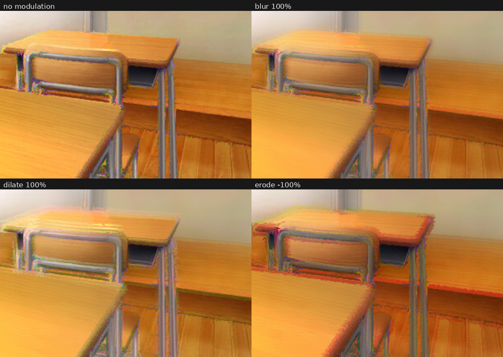

強度24px / 半径4px。

| 設定 | 平均変化 | 見え方 |
|---|---|---|
| 変調なし | 4.0 | — |
| ぼかし100% | 6.1 | 流れを保ったままザラつきが落ちる。ノイズ取りとして使える |
| 膨張100% | 9.0 | 明るいチャンネルが広がり、全体が白っぽく発光する |
| 収縮-100% | 10.2 | 暗いほうへ寄り、色が濃く沈む。ここでは強い赤の縁が出た |

変位が「色をどこから持ってくるか」を変えるのに対して、変調は
**チャンネルの値そのものを上下させる**。だから膨張・収縮は色かぶりを起こす。
画面全体の明るさや色味が動いてしまうので、**適用量とセットで調整するのが前提**。

ぼかしだけは色かぶりを起こさず、歩幅を詰めきれないときのノイズ対策として素直に使える。

### 適用量 — 形を変えずに強さだけ落とす

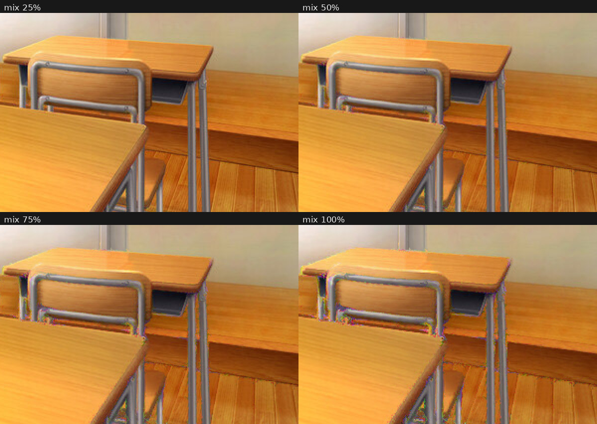

最後に元画像と混ぜるだけなので、**流れの形はそのままで濃さだけが変わる**。
平坦な部分のザラつきも同じ比率で薄まるので、
「効果の見た目は気に入っているがノイズが気になる」ときの最終手段になる。

反復回数が2以上のときは1パスごとに適用されるので、実際の減衰は `適用量 ^ 反復回数` に近くなる。
反復を増やしたら適用量は上げ直すこと。

### 負荷について

1画素あたりのサンプリング数は
**`勾配タップ数 × (3 × ステップ数 − 2) + 3 + フィルタ24`**（これに反復回数が掛かる）。
勾配タップ数は検出半径1px以下なら4、それ以上なら8。

| 設定 | タップ数 |
|---|---|
| ステップ数1・変調なし | 7 |
| ステップ数8（既定）・変調なし | 91 |
| ステップ数8・変調あり | 115 |
| ステップ数64（強度192px向け）・変調なし | 763 |

- ぼかしも膨張・収縮も0%のときは、フィルタ処理ごとシェーダー内でスキップされる（24タップぶん）
- ステップ数は1歩ごとに3チャンネル分の勾配を取り直すので、増やすとほぼ比例して重くなる。
  1歩目だけは勾配を使い回すため、ステップ数1なら追加コストはゼロ
- 検出半径を1pxより大きくすると勾配タップが倍になる。半径を上げるより
  「感度」と「ガンマ」で調整できないか先に試すとよい
- 反復回数はパス数が増えるが、**同じ合計移動量で比べるならステップ数に振るのと大差ない**
  （上の反復回数の項を参照）。ただしD2Dのパス自体のコストは上の式に入っていない

## インストール

1. [Releases](../../releases) から `.ymme` ファイルをダウンロードする（または自分でビルドする）
2. `.ymme` ファイルをダブルクリックする
3. YMM4を起動し、`設定` → `プラグイン` → `プラグイン一覧` に `Sa_CrossChroma` が出ていれば成功

手動で入れる場合は、`Sa_CrossChroma.dll` を `YMM4フォルダ\user\plugin\Sa_CrossChroma\` に置く。

使うときは、映像アイテムの `エフェクトを追加` → `加工` → `クロスクロマ`。

## ビルド

### 必要なもの

- YMM4 本体（v4.47.0.0以降 = .NET10版）
- Visual Studio 2022 以降、または .NET SDK
- Windows SDK（HLSLのコンパイルに `fxc.exe` を使う。Visual Studioの「C++によるデスクトップ開発」を入れると付いてくる）

### 手順

1. `Directory.Build.props.sample` をコピーして `Directory.Build.props` を作り、
   `YMM4DirPath` にYMM4のインストールフォルダを設定する（末尾の `\` を忘れずに）

   ```xml
   <YMM4DirPath>C:\Program Files\YMM4\</YMM4DirPath>
   ```

2. `Sa_CrossChroma.sln` を開いてビルドする（または `dotnet build -c Release`）

ビルド時に `Shaders\CrossChroma.hlsl` が `fxc.exe` で `ps_4_0` にコンパイルされ、
dllに埋め込まれる。ビルド後、dllは自動で `YMM4フォルダ\user\plugin\Sa_CrossChroma\` にコピーされる。

`fxc.exe` が自動で見つからない場合は、`Directory.Build.props` に `FxcPath` を直接書く。

> **v4.46.x.x以前のYMM4向けにビルドする場合**は、`src/Sa_CrossChroma/Sa_CrossChroma.csproj` の
> `<TargetFramework>` を `net8.0-windows` に変更する。

## リポジトリ構成

```
src/Sa_CrossChroma/
  CrossChromaEffect.cs            エフェクトの設定項目（YMM4のUIに出る部分）
  CrossChromaProcessor.cs         フレームごとの更新処理
  CrossChromaCustomEffect.cs      ID2D1Effectとしての実装・定数バッファ
  CrossChromaShaderParameters.cs  シェーダーに渡す値一式
  ChannelRouting.cs               チャンネルの組み合わせ
  ShaderResourceLoader.cs         埋め込みシェーダーの読み込み
  Shaders/CrossChroma.hlsl        本体（ピクセルシェーダー）

tools/reference/
  crosschroma.py                  HLSLと同じ計算のCPUリファレンス実装
  test_crosschroma.py             テスト
  render_samples.py               サンプル画像の生成

docs/samples/                     READMEに貼っているサンプル
```

## 開発

GPUを使うシェーダーはそのままではテストしづらいので、
`tools/reference/crosschroma.py` にHLSLと同じ計算のCPU実装を置いている。
アルゴリズムを変えるときは、シェーダーとこちらを両方更新する。

```bash
pip install numpy pillow

# テスト（アルゴリズムの振る舞い + 3実装の整合性チェック）
python3 tools/reference/test_crosschroma.py

# サンプル画像の生成
python3 tools/reference/render_samples.py docs/samples/00-source.jpg docs/samples
```

テストは振る舞いだけでなく、**HLSLの定数バッファ / C#の構造体 / プロパティID / Pythonの定数**が
同じ並び・同じ値になっているかも突き合わせる。
定数バッファは並び順がずれても無言で壊れるだけなので、ここで機械的に止めている。

## 動作確認について

- アルゴリズム（変位・ステップ分割・反復・回転・変調・アルファの扱い）は、
  CPUリファレンス実装に対する35件のテストと、上のサンプル画像のレンダリングで確認している
- 4タップ版の勾配が8タップSobelと一致すること、止まった画素の打ち切りが結果を変えないことも
  テストで押さえている（高速化のつもりで絵を変えてしまわないように）
- 「パラメーターを振ってみた結果」の比較画像は、速度のために一部だけを計算している。
  それが全画面をレンダリングした結果と同じ絵になることもテストで確認している
- HLSL / C# / Python の3実装が食い違っていないことは、テストで機械的に検証している
- **C#とHLSLの実ビルド、およびYMM4上での動作確認は、Windows + YMM4本体が必要なため未実施**。
  最初のビルド時はYMM4のバージョンとの整合（`TargetFramework`、参照DLL）を確認してほしい

## ライセンス

未設定。公開する場合は、リポジトリにライセンスファイルを追加すること。

`docs/samples/` の画像は、動作確認用に提供されたテスト画像とその加工結果。
リポジトリを公開する場合は、元画像の権利を確認して差し替えること。
